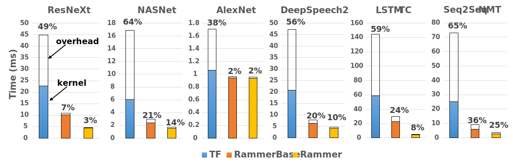

# OSDI'20 Artifacts Evaluation

## 0. Overview
  This code branch is used for OSDI'20 Artifact Evaluation of paper #292, titled "[Rammer: Enabling Holistic Deep Learning Compiler Optimizations with rTasks](https://www.usenix.org/conference/osdi20/presentation/ma)". 

### Terminology
Note that the system name of "Rammer" is only used in paper, our implementation of "Rammer" is called NNFusion, which is an end-to-end deep learning compiler. All the major Rammer-related techniques are implemented as an optimization module in NNFusion called "BlockFusion". If you want to go into deep of our source code, it is helpful to know the concept mapping from the ones in our paper to those in the source code.

| Name in Paper   | Name in Code |  Source File |
| -----------     | -----------  |  ----------- |                
| Rammer          | NNFusion     |  src/nnfusion/engine/pass/graph/blockfusion/            |
| RammerBase      | NNFusion (no BlockFusion Opt)  | -
| rOperator       | BlockCudaEmitter | src/nnfusion/core/kernels/cuda_gpu/cuda_emitter.hpp |
| rProgram        | BlockExecutorProgram | src/nnfusion/engine/pass/graph/blockfusion/common.hpp |
| rTask           | BlockExecutorInstruction | src/nnfusion/engine/pass/graph/blockfusion/common.hpp |
| vDevice         | BlockParallelDevice | src/nnfusion/engine/pass/graph/blockfusion/block_parallel_device.hpp |

### Evaluation Setup

- Artifacts Available: 
    - All Rammer related code are available in: https://github.com/microsoft/nnfusion

- Artifacts Functional:
    - *Documentation*: the following of documents include detailed guidelines on how to build, install, test NNFusion and the experiments to compare with other baselines.
    - *Completeness*: the source code of NNFusion includes all the key components of Rammer described in the paper.
    - *Exercisability*: under the *artifacts* folder, we prepare all the script and data to reproduce the experiements in individual folders named by the figure name in paper.

- Results Reproduced:
    - To reproduce the main results presented in our paper, we provide a Docker image containing all the environments and baseline software, and an Azure NC24s_v3 VM with the same configurations as we used in paper evaluation. As the GraphCore and ROCm environments are internal resoruces with resitrict accessbility, we use the CUDA GPUs (NVIDIA Tesla V100 GPU) environment to reproduce the main results. We also provide detailed guideline to help reproduce the results step by step.


## 1. Environment Preparation

To ease the process of installing all the dependencies, baseline softwares, and NNFusion binary, we provide a Dockerfile and a simple guideline to build a Docker image with all of above installed:

* First, checkout the NNFusion code:
    ```
    git clone https://github.com/microsoft/nnfusion nnfusion -b osdi20_artifact
    ```
* Build a docker container named as *rammer_cuda*:
    ```
    cd nnfusion/artifacts/
    bash scripts/build_container.sh
    ```
* Run into the container and execute a bash environment. If you want to reset the container, you can execute the *remove_container.sh* before this:
    ```
    bash scripts/open_container_old_docker.sh
    ```
* Now, supposedly you are inside the container and located in */root/nnfusion/*. Then you can insatll all baseline software (e.g., TensorFlow 1.15.2, Tensor RT-7.0.0, TVM-0.7) and NNFusion through:
    ```
    bash artifacts/scripts/build_and_install_deps.sh
    ```
* For better evaluation figure produced, the font named Times-New-Roman need to be installed by this command:
    ```
    apt install ttf-mscorefonts-installer
    ```
* It is recommended to use a 4K monitor when you plotting the figure, as the gnuplot scripts might produce unligned figures in a non-4K monitor.

So far, you are ready to run NNFusion. Besides, if you want to run the evaluation in your native enviroment and build everything from scratch, please follow [README_DEPENDENCY.md](README_DEPENDENCY.md) and install each of them step by step. We recommend to use a Ubuntu 16.04 environment.

## 2. Getting Started with a Simple Example

 - Go to the *get_started_tutorial/* folder and follow [README_GET_STARTED.md](get_started_tutorial/README_GET_STARTED.md).

## 3. Freezing Models and Generating rKernels

Before we start to run the evaluation experiements, we need to take two steps to prepare the evaluation setup:
 - **STEP 1: Freezing all evaluated benchmark models.** 
     - Please go to the *frozen_models* folder and follow [README_FREEZE_MODEL.md](frozen_models/README_FREEZE_MODEL.md).
 - **STEP 2: Generating all kernels for Rammer.** 
     - Please go to the *kernel_db* folder and follow [README_KERNEL_DB.md](kernel_db/README_KERNEL_DB.md).

## 4. Reproducing Individual Experiement Results
**NOTE**: Each of the below experiments might take a relatively long time (e.g., 1 hour).

| Experiments   | Figure # in Paper |  Script Location | Instructions | 
| -----------     | -----------  |  ----------- |    ----------- |              
| #1. End-to-end comparation with the state-of-the-arts  | Figure 11 | nnfusion/artifacts/figure11 | [README_FIGURE11.md](figure11/README_FIGURE11.md) |
| #2. Performance with different batch sizes | Figure 12 | nnfusion/artifacts/figure12 | [README_FIGURE12.md](figure12/README_FIGURE12.md) |
| #3. Performance with larger input size | Figure 13 | nnfusion/artifacts/figure13 | [README_FIGURE13.md](figure13/README_FIGURE13.md) |
| #4. Comparison of GPU utilization | Figure 14 | nnfusion/artifacts/figure14 | [README_FIGURE14.md](figure14/README_FIGURE14.md) |
| #5. Comparison of GPU scheduling overhead | Figure 16 | nnfusion/artifacts/figure16 | [README_FIGURE16.md](figure16/README_FIGURE16.md) |
| #6. Interplay of intra and inter operator scheduling | Figure 17 | nnfusion/artifacts/figure17 | [README_FIGURE17.md](figure17/README_FIGURE17.md) |

## 5. Performance on NVIDIA CUDA GPU

Here, we show some evaluation results on a **NVIDIA Tesla V100 GPU (Azure NC24s_v3 VM)**. All data reported here are on the inference task with batch size 1. More evaluation details and results can be found in our [OSDI'20 paper](https://www.usenix.org/conference/osdi20/presentation/ma).

Baselines:
* Deep learning framework: TensorFlow-1.15.2 (TF)
* Deep learning compilers: TensorFlow-XLA-1.15.2 (TF-XLA), TVM-0.7 (TVM)
* Vendor optimized proprietary DNN inference library from NVIDIA: TensorRT-7.0 (TF-TRT)

### 1. End-to-end Performance

This figure shows how NNFusion (Rammer) performs comparing with the state-of-the-art DNN frameworks and compilers.

<p align="center">
  
</p>

### 2. GPU Utilization

This figure shows how well NNFusion (Rammer) utilizes the GPU's parallel resource.

<p align="center">
  
</p>

### 3. Scheduling Overhead

This figure shows how much NNFusion (Rammer) reduces the runtime scheduling overhead.

<p align="center">
  
</p>